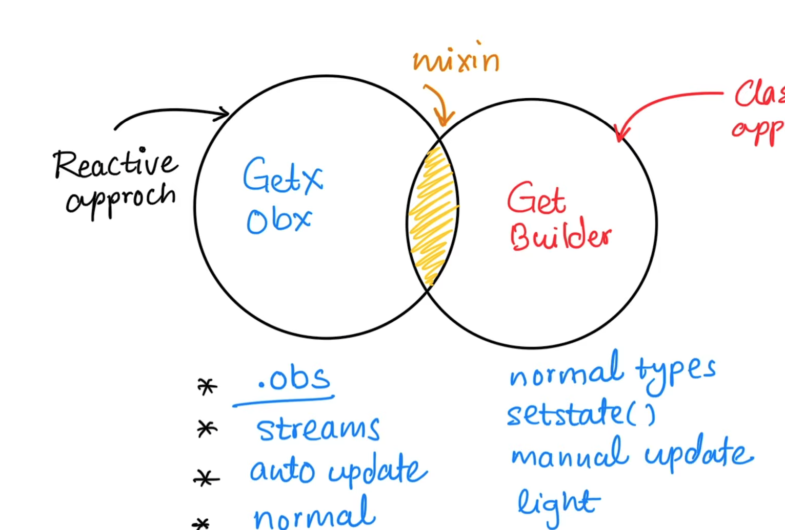

Streambuilders widget is used for listening to data events flowing from the stream (asynchronous events with streams of data) and rebuild the widget with the latest data.

When working with the MVC architecture - Controllers are based on the FUNCTIONALITIES and not based on the page (as MVVM architecture would be). So sometimes your view may have more than 1 Controller depending on the functionality of that view.

